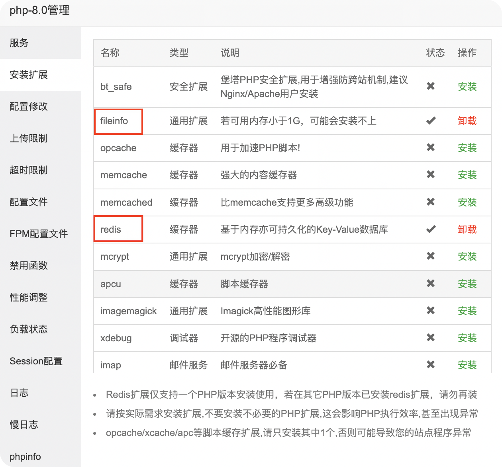
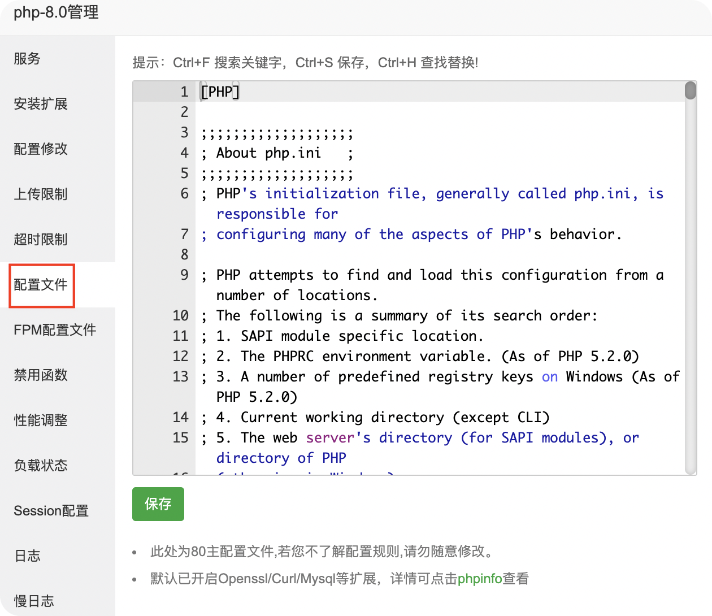
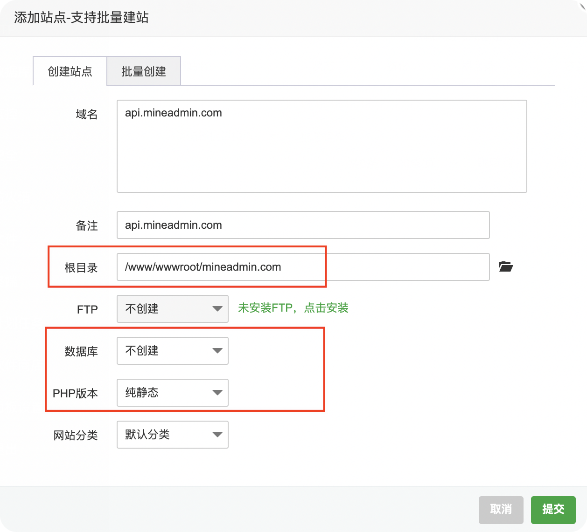
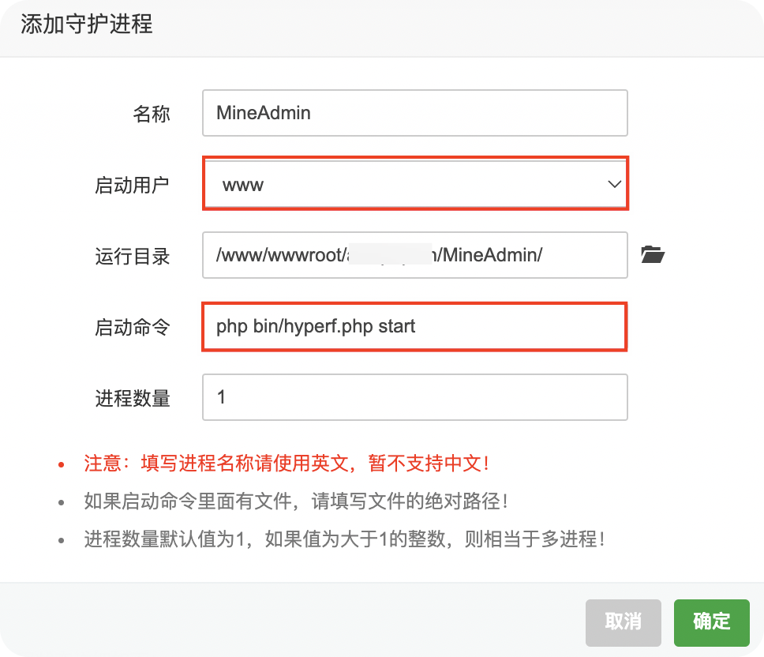

# 安装部署

## 服务器及环境需求

#### 服务器要求
MineAdmin 对系统环境有一些要求，当您使用 Swoole 网络引擎驱动时，仅可运行于 Linux 和 Mac 环境下，但由于 Docker 虚拟化技术的发展，在 Windows 下也可以通过 Docker for Windows 来作为运行环境。

#### 环境需求

- Swoole >= 4.6.x 并关闭 `Short Name`
- PHP === 8.0 并开启以下扩展：
    - mbstring
    - json
    - pdo
    - openssl
    - redis
    - pcntl
- Mysql >= 5.7
- Redis >= 4.0

## 下载项目
- MineAdmin没有使用SQL文件导入安装，系统使用Migrates迁移文件形式安装和填充数据，请知悉。

- 项目下载，请确保已经安装了 `Composer`
```shell
git clone https://gitee.com/xmo/MineAdmin && cd MineAdmin
composer config -g repo.packagist composer https://mirrors.aliyun.com/composer/
composer install
```

## 后端安装
 - 项目安装需要开两个终端，一个启动项目，一个执行安装命令

打开启动终端，启动项目
```shell
php bin/hyperf.php start
```
切换到安装终端，执行安装命令，完成`.env`文件的配置
```shell
php bin/hyperf.php mine:install
```
待提示以下信息后，切换到启动终端，重启项目，加载`.env`配置信息
```shell
Reset the ".env" file. Please restart the service before running 
the installation command to continue the installation.
```
切换到安装终端，再次执行安装命令，执行Migrates数据迁移文件和SQL数据填充，完成安装。
```shell
php bin/hyperf.php mine:install
```

## 前端安装

请先确保安装了node.js，yarn 或者 npm 工具，建议使用yarn
```shell
cd mine-ui && yarn
or
cd mine-ui && npm install
```
启动
```shell
yarn dev
or
npm run dev
```

:::tip
实际开发中，可以使用 `php watch -c` 来启动项目，它可以监听文件的改动实时热重启，提高开发效率。
:::

## Docker 部署
移步这里看 [Docker部署文档](https://gitee.com/xmo/MineAdmin/issues/I4ZRZ6)

## 宝塔部署
:::tip
宝塔部署教程 `刺客` 提供，感谢他做的测试和部署教程的制作
:::

### 安装宝塔面板
1. ECS服务器,重新初始化操作系统 , 安全组开放宝塔面板所需网络端口。例如：8888端口。
2. 安装面板，执行以下命令：
```bash
yum install -y wget && wget -O install.sh http://download.bt.cn/install/install_6.0.sh && sh install.sh
```
3. 按提示打开宝塔面板，完成下述各项操作步骤。

### 安装 WEB 应用
:::tip
目前 `Supervisor` 对系统监控会造成不可用状态，请知悉！未来版本将解决此问题。
:::

在软件商店中搜索如下应用，并按提示完成安装即可。

```bash
nginx:1.21
mysql:5.7
php:8.0
phpmyadmin:5.1

Supervisor管理器
Node.js版本管理器
```

### PHP8.0 配置
在软件商店-php8.0管理中进行如下配置操作。

1. 安装扩展：如下图所示，在“ PHP8.0 管理-安装扩展 ”中，安装 `fileinfo`、`redis`、`swoole` 扩展。



2. 配置文件更新配置环境：如下图所示，在“ PHP8.0 管理-配置文件 ”右侧文本编辑器中，按下述提示进行配置更新。

 

### 禁用函数

> 从禁用函数中开放如下函数：`putenv, shell_exec, proc_open, pcntl` 系列函数

* 初始禁用函数清单
```bash
disable_functions = passthru,exec,system,putenv,chroot,chgrp,chown,shell_exec,popen,proc_open,pcntl_exec,ini_alter,ini_restore,dl,openlog,syslog,readlink,symlink,popepassthru,pcntl_alarm,pcntl_fork,pcntl_waitpid,pcntl_wait,pcntl_wifexited,pcntl_wifstopped,pcntl_wifsignaled,pcntl_wifcontinued,pcntl_wexitstatus,pcntl_wtermsig,pcntl_wstopsig,pcntl_signal,pcntl_signal_dispatch,pcntl_get_last_error,pcntl_strerror,pcntl_sigprocmask,pcntl_sigwaitinfo,pcntl_sigtimedwait,pcntl_exec,pcntl_getpriority,pcntl_setpriority,imap_open,apache_setenv
```
* 删除后的禁用函数清单
```bash
disable_functions = passthru,system,chroot,chgrp,chown,popen,ini_alter,ini_restore,dl,openlog,syslog,readlink,symlink,popepassthru,imap_open,apache_setenv
```

### 其他配置
:::tip
 `PHP` 默认的`memory_limit` 只有`128M`，因为 `Hyperf` 使用了 `BetterReflection`，不使用扫描缓存时，会消耗大量内存，所以可能会出现内存不够的情况。
:::
* 修改 memory_limit 配置
```bash
memory_limit=-1
```
* 关闭swoole短名
```bash
swoole.use_shortname = 'Off'
 ```
 
重载配置，重启 php 服务。

### 安装 MineAdmin
:::tip
安装前必看重要提示：

由于项目是前后端分离方式开发和部署的，所以安装演示过程中会用到三个域名。假设你自己的主域名是 mineadmin.com，那你可以分别配置为，以下域名可以自定义，下面只是举例。按如下步骤在宝塔面板进行站点配置。
:::


1. 在宝塔面板-网站-PHP 项目中，添加如下站点。

* 后端API接口：`api.mineadmin.com`
* 消息通知：`message.mineadmin.com`

按下图所示，数据库选择不创建，PHP 版本选择纯静态。



2. 待下载项目后，在宝塔面板-网站- Node 项目中， 添加如下站点，在后续第三章（四）节介绍具体操作。

* 管理后台：`admin.mineadmin.com`

### 生产部署
:::tip
再次提示：目前 `Supervisor` 对系统监控会造成不可用状态，请知悉！未来版本将解决此问题。
:::
使用Supervisor管理器部署，实现`php bin/hyperf.php start`进程守护

打开Supervisor管理器，按下图所示进行配置：



## 服务器部署

项目需要线上环境部署或者测试的时候，本地与线上环境不一致或者前端和后端不在一个服务器上面，需要进行 Nginx 反向代理，以及修改前端部分配置。
### 后端代理HTTP代理
:::tip
生产环境一般都会用 Nginx 代理发布，实现负载均衡等。
:::

```shell
# 至少需要一个 Hyperf 节点，多个配置多行
upstream hyperf {
    # Hyperf HTTP Server 的 IP 及 端口
    server 127.0.0.1:9501;
}

server {
  # 端口
  listen 80;
  # 域名
  server_name demo.mineadmin.com;
  # 日志
  access_log /data/wwwlogs/demo.mineadmin.com_nginx_access.log combined;
  error_log /data/wwwlogs/demo.mineadmin.com_nginx_error.log debug;

  # 同域根目录前端代码部署,注意：
  location / {
      root /data/wwwroot/demo.mineadmin.com;
      try_files $uri $uri/ /index.html;
      index index.html;
  }

  # 支持自定义下划线参数通过header传输
  # underscores_in_headers on;

  # PHP 代码
  location /api/ {
      # 将客户端的 Host 和 IP 信息一并转发到对应节点
      proxy_set_header Host $http_host;
      proxy_set_header X-Real-IP $remote_addr;
      proxy_set_header X-Forwarded-For $proxy_add_x_forwarded_for;
      # 将协议架构转发到对应节点，如果使用非https请改为http
      proxy_set_header X-scheme https;

      # 执行代理访问真实服务器
      proxy_pass http://hyperf/;
  }
}
```
### 后端代理WebSocket消息服务器代理
:::tip
`v0.5.0`版本新增了队列消息功能，通信使用websocket方式，所以还需要配置消息服务器代理
:::
```shell
# 至少需要一个 message 节点，多个配置多行
upstream message {
    # Hyperf HTTP Server 的 IP 及 端口
    server 127.0.0.1:9502;
}
server {
    # 端口
    listen 80;
    # 域名
    server_name message.mineadmin.com;
    # 日志
    access_log /data/wwwlogs/message.mineadmin.com_nginx_access.log combined;
    error_log /data/wwwlogs/message.mineadmin.com_nginx_error.log debug;

    location / {
        # WebSocket Header
        proxy_http_version 1.1;
        proxy_set_header Upgrade websocket;
        proxy_set_header Connection "Upgrade";

        # 将客户端的 Host 和 IP 信息一并转发到对应节点
        proxy_set_header X-Real-IP $remote_addr;
        proxy_set_header X-Forwarded-For $proxy_add_x_forwarded_for;
        proxy_set_header Host $http_host;

        # 客户端与服务端无交互 60s 后自动断开连接，请根据实际业务场景设置
        proxy_read_timeout 60s ;

        # 执行代理访问真实服务器
        proxy_pass http://message/;
	}
}
```

### 前端必要配置
前端也使用了代理方式来请求后端接口

在 `mine-ui/.env` 里面找到以下配置，根据自己的情况修改
```shell
# 基础url
VUE_APP_URL=http://127.0.0.1:9501

# 代理API前缀
VUE_APP_API=/api

# WebSocket url
VUE_APP_WS_URL=ws://127.0.0.1:9502/message.io
```

## 存在兼容性问题的扩展

由于 Hyperf 基于 Swoole 协程实现，而 Swoole 4 带来的协程与不少扩展都仍存在兼容性的问题。
以下扩展（包括但不限于）都会造成一定的兼容性问题，不能与之共用或共存：

- xhprof
- xdebug
- blackfire
- trace
- uopz